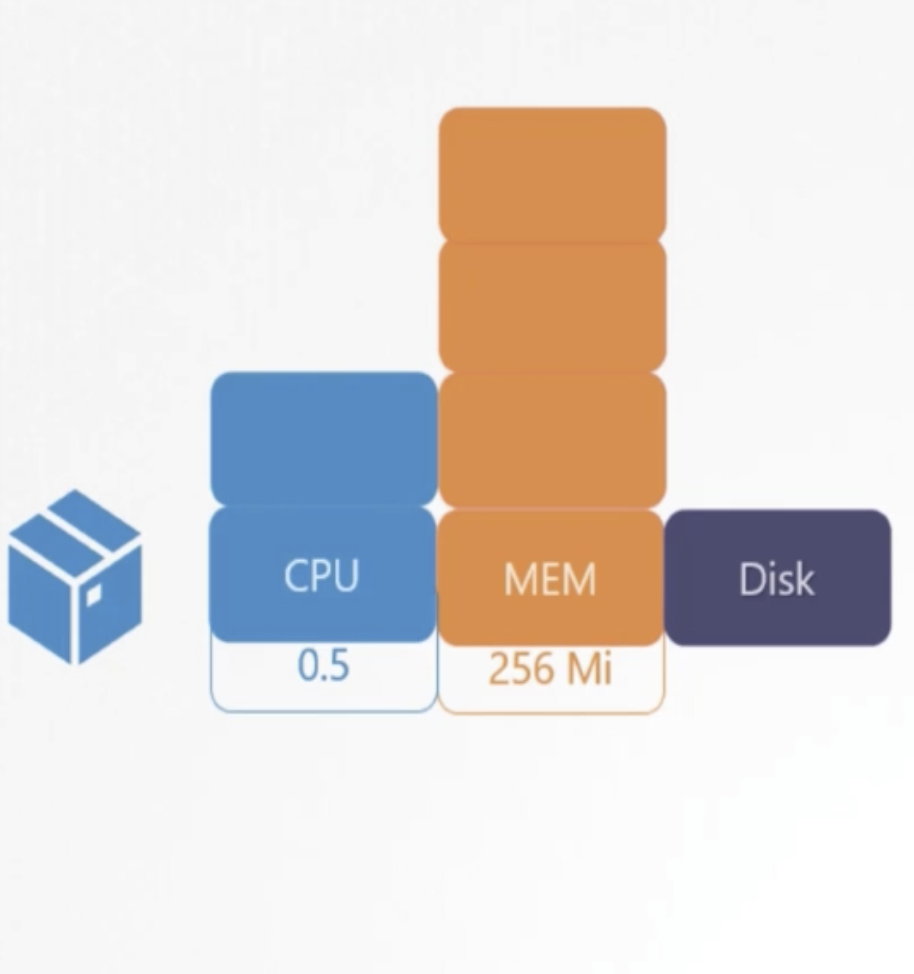

# CKAD Notes

## Exam Version
Version 1.21

## Exam Details
- [Technical Instructions](https://www.cncf.io/certification/ckad/)
- [Exam Cluster Environment](https://www.cncf.io/certification/ckad/)

## Current Progress
The list below is based on the curriculum v1.0. Once you have mastered a section, check it off and move on to the next. You need to understand them ALL very well. The Core Concepts piece is kind of vague, but the others are defined well enough that it is easy to prepare for with a hands-on work through the tasks offered at kubernetes.io. The rest of this document follows this same outline of curriculum.

- [x] __Core Concepts - 13%__
  - [x] API Primitives
  - [x] Create and Configure Basic Pods
- [x] __Configuration - 18%__
  - [x] Understand ConfigMaps
  - [x] Understand SecurityContexts
  - [x] Define App Resource Requirements
  - [x] Create and Consume Secrets
  - [x] Understand Service Accounts
- [x] __Multi-Container Pods - 10%__
  - [ ] Design Patterns: Ambassador, Adapter, Sidecar
    - [ ] - Sidecar Pattern
    - [ ] - Init Containers
- [ ] __Pod Design - 20%__
  - [ ] Using Labels, Selectors, and Annotations
  - [ ] Understand Deployments and Rolling Updates
  - [ ] Understand Deployment Rollbacks
  - [ ] Understand Jobs and CronJobs
- [ ] - __State Persistence - 8%__
  - [ ] - Understand PVCs for Storage
- [ ] __Observability - 18%__
  - [ ] Liveness and Readiness Probes
  - [ ] Understand Container Logging
  - [ ] Understand Monitoring Application in Kubernetes
  - [ ] Understand Debugging in Kubernetes
- [ ] __Services and Networking - 13%__
  - [ ] Understand Services
  - [ ] Basic Network Policies

## 1. Core Concepts

The core concepts section covers the core K8s API and its primitives and resources. It also covers the important concept of a POD. This is the basic unit of deployment for app developers and so this 'POD' concept is important to understand as well as how they are managed with kubectl. To me, this is embodied in the kubectl RUN command.

### 1.1. Pods

A Pod (as in a pod of whales or pea pod) is a group of one or more containers, with shared storage and network resources, and a specification for how to run the containers. A Pod's contents are always co-located and co-scheduled, and run in a shared context. 

|     Kind      |    Version    |
| ------------- | ------------- |
| Pod           | v1            |
| Service       | v1            |
| ReplicaSet    | apps/v1       |
| Deployment    | apps/v1       |

#### 1.1.1 Pod Definition

A sample `.yaml` file of pod definition file. The fields required are apiVersion, kind, metadata and spec. Refer to [pod_definition.yaml]("1.%20Core-Concepts/pod_definition.yaml")

```
apiVersion: v1
kind: Pod
metadata:
  name: myapp-pod
  labels:
    app: myapp
    type: frontend
spec:
  containers:
    - name: nginx-container
      image: nginx
```

#### 1.1.2 Pod Information and Commands

Below are simple commands to retrieve pod information. We can either retrieve all of the pod information or a specific detailed pod information

```
$ kubectl get pods

NAME                            READY   STATUS    RESTARTS   AGE
myapp-pod-798bbc95c7-62cc7      1/1     Running   0          15d
mydb-pod-987478c7-2lpzq         1/1     Running   0          5d1h
```
```
$ kubectl describe pod myapp-pod

Name:         myapp-pod
Namespace:    default
Priority:     0
Node:         ip-192-168-123-123.ap-southeast-1.compute.internal/192.168.123.123
Start Time:   Mon, 01 Jun 2021 23:59:59 +0800

.....
```

If you are not given a pod definition file, you may extract the definition to a file using the below command:
```
$ kubectl get pod myapp-pod -o yaml > pod-definition-sample.yaml
```

If you wish to edit the pod directly to change the configuration, you may use the following command
```
kubectl edit pod <pod-name>
```

### 1.2. ReplicaSet

A ReplicaSet's purpose is to maintain a stable set of replica Pods running at any given time. As such, it is often used to guarantee the availability of a specified number of identical Pods.

#### 1.2.1  ReplicaController Definition

A sample `.yaml` file of a replicaSet definition file. The fields required are apiVersion, kind, metadata, spec and replicas Refer to [replicacontroller_definition.yaml]("1.%20Core-Concepts/replicacontroller_definition.yaml")

```
apiVersion: v1
kind: ReplicationController
metadata:
  name: myapp-rc
  labels:
    app: myapp
    type: frontend
spec:
  template:
    metadata:
      name: myapp-pod
      labels:
        app: myapp
        type: frontend
      spec:
        containers:
        - name: nginx-container
          image: nginx
  replicas: 3

```

Basic Commands to retrieve information on replica controller
```
$ kubectl create -f rc-definition.yaml
$ kubectl get replicacontroller
```

#### 1.2.2  ReplicaSet Definition

A sample `.yaml` file of a replicaSet definition file. The fields required are apiVersion, kind, metadata, spec, selector and replicas. Refer to [replicaset_definition.yaml]("1.%20Core-Concepts/replicaset_definition.yaml")

```
apiVersion: v1
kind: ReplicaSet
metadata:
  name: myapp-replicaset
  labels:
    app: myapp
    type: frontend
spec:
  template:
    metadata:
      name: myapp-pod
      labels:
        app: myapp
        type: frontend
      spec:
        containers:
        - name: nginx-container
          image: nginx
  replicas: 3
  selector: 
    matchLabels:
      type: frontend
```
<br>
<p align="center">
  
</p>
<br>

Basic Commands to retrieve information on replica controller
```
$ kubectl create -f replicaset-definition.yaml
$ kubectl delete replicaset myapp-replicaset
$ kubectl get replicaset
```

We can also update the amount of replicas by scaling in or out with the following command
```
$ kubectl replace -f replicaset-definition.yaml

OR

$ kubectl scale --replicas=6 -f replicaset myapp-replicaset
```

### 1.3 Deployment

A Deployment provides declarative updates for Pods and ReplicaSets.

You describe a desired state in a Deployment, and the Deployment Controller changes the actual state to the desired state at a controlled rate. You can define Deployments to create new ReplicaSets, or to remove existing Deployments and adopt all their resources with new Deployments.

<br>
<p align="center">
  
</p>
<br>

#### 1.3.1  Deployment Definition

A sample `.yaml` file of a deployment definition file. The fields required are apiVersion, kind, metadata, spec, selector and replicas Refer to [deployment_definition.yaml]("1.%20Core-Concepts/deployment_definition.yaml")

```
apiVersion: apps/v1
kind: Deployment
metadata:
  name: myapp-deployment
  labels:
    app: myapp
    type: frontend
spec:
  template:
    metadata:
      name: myapp-pod
      labels:
        app: myapp
        type: frontend
      spec:
        containers:
        - name: nginx-container
          image: nginx
  replicas: 3
  selector: 
    matchLabels:
      type: frontend
```

Basic Commands to retrieve information on a deployment
```
$ kubectl create -f deployment-definition.yaml
$ kubectl delete deployment myapp-deployment
$ kubectl get deployments
```


Get all commands allows us to retrive every single deployed info such as replicaset, deployments and pods
```
$ kubectl get all

NAME                            DESIRED   CURRENT    UP-TO_DATE   AVAILABLE   AGE
deploy/myapp-deployement        3         3          3            3           9h

NAME                            DESIRED   CURRENT    READY   AGE
rs/myapp-deployement-1234567    3         3          3       3

NAME                               READY   STATUS    RESTARTS   AGE
po/myapp-deployement-1234567-abc   1/1     Running   0          9h
po/myapp-deployement-1234567-def   1/1     Running   0          9h
po/myapp-deployement-1234567-hij   1/1     Running   0          9h
```

### 1.4 Namespaces

Kubernetes supports multiple virtual clusters backed by the same physical cluster. These virtual clusters are called namespaces. Namespaces provide a scope for names. Names of resources need to be unique within a namespace, but not across namespaces. Namespaces cannot be nested inside one another and each Kubernetes resource can only be in one namespace. Namespaces are a way to divide cluster resources between multiple users.

#### 1.4.1  Namespace Endpoints

<br>
<p align="center">
  
</p>
<br>

Resources within a namespace can be referred via the namespace. In the default namesace we can connect to the db-service by using the endpoint

```
db-service
```

However, we can specify an endpoint within a namespace by using the following `service endpoint` instead. A DNS entry is added in this format when a namespace is added.
```
db-service.dev.svc.cluster.local
```

#### 1.4.2  Namespace Commands

Retrieve all pods within a specific namespace

```
$ kubectl get pods --namespace=dev
```
Create a pod within a specific namespace

```
$ kubectl create -f pod-definition.yaml --namespace=dev
```

In addition, we can specify the `namespace` within a definition file metadata. This limits the creation of the pod for example within the dev namespace as shown below:

```
apiVersion: v1
kind: Pod
metadata:
  name: myapp-pod
  namespace: dev
  labels:
    app: myapp
    type: frontend
spec:
  containers:
    - name: nginx-container
      image: nginx
```

Creating a namespace definition file with the follwing commands:

```
apiVersion: v1
kind: Namespace
metadata:
  name: dev
```

```
$ kubectl create -f namespace-dev.yaml
```

OR

```
$ kubectl create namespace dev
```

For easier access when running commands in a specific namespace, we can set the namespace permenently by running the following command:
```
$ kubectl config set-context $(kubectl config current-context) --namespace=dev
```

View all pods in all namespace
```
$ kubectl get pods --all-namespaces
```

#### 1.4.3  Resource Quota
A resource quota, defined by a ResourceQuota object, provides constraints that limit aggregate resource consumption per namespace. It can limit the quantity of objects that can be created in a namespace by type, as well as the total amount of compute resources that may be consumed by resources in that namespace.

<br>
<p align="center">
  
</p>
<br>

```
apiVersion: v1
kind: ResourceQuota
metadata:
  name: compute-quota
  namespace: dev
spec:
  hard:
    pods: "10"
    requests.cpu: "4"
    requests.memory: 5Gi
    limits.cpu: "10"
    limits.memory: 10Gi
```

```
$ kubectl create -f compute-quota.yaml
```

### 1.5 Imperative Commands

Imperative commands can help in getting one time tasks done quickly, as well as generate a definition template easily.

#### 1.5.1  Dry Run
By default as soon as the command is run, the resource will be created. Dry run will not create the resource, instead, tell you whether the resource can be created and if your command is right.
```
--dry-run=client
```
#### 1.5.2 Output
This will output the resource definition in YAML format on the screen.
```
-o yaml
```

#### 1.5.3 Pod
```
$ kubectl run nginx --image=nginx
$ kubectl run nginx --image=nginx --dry-run=client -o yaml
```

#### 1.5.4 Deployment
```
$ kubectl create deployment --image=nginx nginx
$ kubectl create deployment --image=nginx nginx --dry-run=client -o yaml
```
#### 1.5.5 Replicas
```
$ kubectl create deployment nginx --image=nginx --replicas=4
$ kubectl scale deployment nginx --replicas=4
$ kubectl create deployment nginx --image=nginx--dry-run=client -o yaml > nginx-deployment.yaml
```

#### 1.5.6 Service
```
$ kubectl expose pod redis --port=6379 --name redis-service --dry-run=client -o yaml
```

## 2. Configuration

Configuration covers how run-time 'config' data is provided to your applications running in k8s. This includes environment variables, config maps, secrets, etc. Other items that are pertinent to config are the service account and security contexts used to execute the containers. The below items are covered by this part of the curriculum.

### 2.1. Environment Variables

When you create a Pod, you can set environment variables for the containers that run in the Pod. To set environment variables, include the env or envFrom field in the configuration file. 

```
apiVersion: v1
kind: Pod
metadata:
  name: envar-demo
  labels:
    purpose: demonstrate-envars
spec:
  containers:
  - name: envar-demo-container
    image: gcr.io/google-samples/node-hello:1.0
    env:
    - name: GREETING
      value: "Warm greetings to"
    - name: HONORIFIC
      value: "The Most Honorable"
    - name: NAME
      value: "Kubernetes"
    command: ["echo"]
    args: ["$(GREETING) $(HONORIFIC) $(NAME)"]
```

Environment variables that you define in a Pod's configuration can be used elsewhere in the configuration, for example in commands and arguments that you set for the Pod's containers. In the example configuration below, the GREETING, HONORIFIC, and NAME environment variables are set to Warm greetings to, The Most Honorable, and Kubernetes, respectively. Those environment variables are then used in the CLI arguments passed to the env-print-demo container.

### 2.2. ConfigmMaps
A ConfigMap is an API object used to store non-confidential data in key-value pairs. Pods can consume ConfigMaps as environment variables, command-line arguments, or as configuration files in a volume.

A ConfigMap allows you to decouple environment-specific configuration from your container images, so that your applications are easily portable.

```
apiVersion: v1
kind: Pod
metadata:
  name: configmap-demo-pod
spec:
  containers:
    - name: demo
      image: alpine
      command: ["sleep", "3600"]
      env:
        - name: PLAYER_INITIAL_LIVES
          valueFrom:
            configMapKeyRef:
              name: game-demo 
              key: player_initial_lives 
        - name: UI_PROPERTIES_FILE_NAME
          valueFrom:
            configMapKeyRef:
              name: game-demo
              key: ui_properties_file_name
```

```
apiVersion: v1
kind: ConfigMap
metadata:
  name: game-demo
data:
  player_initial_lives: 5
  ui_properties_file_name: test
```

### 2.3. Secrets
A Secret is an object that contains a small amount of sensitive data such as a password, a token, or a key. Such information might otherwise be put in a Pod specification or in an image. Users can create Secrets and the system also creates some Secrets.

```
apiVersion: v1
kind: Secret
metadata:
  name: secret-sa-sample
  annotations:
    kubernetes.io/service-account.name: "sa-name"
type: kubernetes.io/service-account-token
data:
  extra: YmFyCg==
```

### 2.4. Security Contexts
A security context defines privilege and access control settings for a Pod or Container Security contexts includes access control, privilleges and linux capibilities

Running at Pod level
```
apiVersion: v1
kind: Pod
metadata:
  name: web-pod
spec: 
  securityContext:
    runAsUser: 1000
  containers:
    - name: ubuntu
      image: ubuntu
      command: ["sleep", "3600"]
```

Running at Container level (Capabitilies field is only supported at container level)
```
apiVersion: v1
kind: Pod
metadata:
  name: web-pod
spec: 
  containers:
    - name: ubuntu
      image: ubuntu
      command: ["sleep", "3600"]
      securityContext:
        runAsUser: 1000
        capabilities:
          add: ["MAC_ADMIN"]
```

### 2.5. Service Account
A service account provides an identity for processes that run in a Pod. When you (a human) access the cluster (for example, using kubectl), you are authenticated by the apiserver as a particular User Account (currently this is usually admin, unless your cluster administrator has customized your cluster). Processes in containers inside pods can also contact the apiserver. When they do, they are authenticated as a particular Service Account (for example, default).

#### 2.5.1. Creating a Service account
```
$ kubect create serviceaccount dashboard-sa
$ kubect get serviceaccount 
$ kubect describe serviceaccount dashboard-sa


Name:                  dashboard-sa
Namespace:             default
Labels:                <none>
Annotations:           <none>
Image pull secrets:    <none>
Mountable secrets:     dashbaord-sa-token-kbbdm
Tokens:                dashbaord-sa-token-kbbdm
Events:                <none>
```

As seen in the mountable and image pull secrets, a hashed token is stored to be used to authenticate within the cluster. 

<br>
<p align="center">
  
</p>
<br>

#### 2.5.2. Viewing the service account token
```
$ kubectl describe secret dashboard-sa-token-kbbdm
```

Curl to the Kubernetes cluster API
```
curl <CLUSTER_ENDPOINT>/api -insecure --header "Authorisation: Bearer <TOKEN>"
```

#### 2.5.3. Using the Service account token in a deployment file
```
apiVersion: v1
kind: Pod
metadata:
  name: my-kube-dashboard
spec: 
  containers:
    - name: my-kube-dashboard
      image: my-kube-dashboard
      serviceAccountName: dashboard-sa
```
**Kubernetes auto mounts the default service account within each namespace**

### 2.6. Resource Requirements
When you specify a Pod, you can optionally specify how much of each resource a Container needs. The most common resources to specify are CPU and memory (RAM); there are others.

When you specify the resource request for Containers in a Pod, the scheduler uses this information to decide which node to place the Pod on. When you specify a resource limit for a Container, the kubelet enforces those limits so that the running container is not allowed to use more of that resource than the limit you set. The kubelet also reserves at least the request amount of that system resource specifically for that container to use.

<br>
<p align="center">
  
</p>
<br>

```
apiVersion: v1
kind: Pod
metadata:
  name: simple-webapp-color
  labels:
    name: simple-webapp-color
spec: 
  containers:
    - name: simple-webapp-color
      image: simple-webapp-color
      ports:
        - containerPort: 8080
      resources:
        requests:   
          memory: "1Gi"
          cpu: 1
```

### 2.6.1. CPU Resource 
Can specify value as low as 0.1 (100m), can go lowest to 1m.

1 CPU = 1 AW vCPU, 1 GCP Core, 1 Azure Core, 1 Hyperthread

### 2.6.2. Memory Resource 
Can specify value by default as 256Mi (268435456)

G (Gigabyte), M (Megabyte), K (Kiloyte), Gi (Gibibyte)

### 2.6.3. Resource Limits
We can specify a max treshold for the amount of resources the pod is able to take in by setting a limit in the pod definition. If it exceeds the CPU or memory the pod will throttle whereas it will terminate the pod when exceeding the memory usage.

```
apiVersion: v1
kind: Pod
metadata:
  name: simple-webapp-color
  labels:
    name: simple-webapp-color
spec: 
  containers:
    - name: simple-webapp-color
      image: simple-webapp-color
      ports:
        - containerPort: 8080
      resources:
        requests:   
          memory: "1Gi"
          cpu: 1
        limits:
          memory: "2Gi"
          cpu: 2
```
### 2.7. Taints and Tolerations
Node affinity is a property of Pods that attracts them to a set of nodes (either as a preference or a hard requirement). Taints are the opposite -- they allow a node to repel a set of pods.

Tolerations are applied to pods, and allow (but do not require) the pods to schedule onto nodes with matching taints.

Taints and tolerations work together to ensure that pods are not scheduled onto inappropriate nodes. One or more taints are applied to a node; this marks that the node should not accept any pods that do not tolerate the taints. Master node is tainted by default

#### 2.7.1. Taints - Node
```
$ kubectl taint nodes node-name key=value:taint-effect (NoSchedule/PreferNoSchedule/NoExecute)

// Example
$ kubectl taint nodes node1 app=blue:NoSchedule
```

#### 2.7.2. Tolerations - Pods
```
apiVersion: v1
kind: Pod
metadata:
  name: myapp-pod
spec:
  containers:
  - name: nginx-controller
    image: nginx
  tolerations:
  - key: "app"
    operator: "Equal"
    value: blue
    effect: NoSchedule
```

### 2.8. Node Selectors
*nodeSelector* is the simplest recommended form of node selection constraint. nodeSelector is a field of PodSpec. It specifies a map of key-value pairs. For the pod to be eligible to run on a node, the node must have each of the indicated key-value pairs as labels (it can have additional labels as well). The most common usage is one key-value pair.

```
apiVersion: v1
kind: Pod
metadata:
  name: myapp-pod
spec:
  containers:
  - name: data-processor
    image: data-processor
  nodeSelector:
    size: large
```

In order for the pod to idenfity the node, we need to label the node with a key value pair

```
$ kubectl label nodes <node-name> <label-key>=<label-value>

// Example
kubectl label nodes node-1 size=Large
```

### 2.8. Node Affinity
*nodeAffinity* is conceptually similar to nodeSelector -- it allows you to constrain which nodes your pod is eligible to be scheduled on, based on labels on the node.

```
apiVersion: v1
kind: Pod
metadata:
  name: myapp-pod
spec:
  containers:
  - name: data-processor
    image: data-processor
  affinity:
    nodeAffinity:
      requiredDuringSchedulingIgnoredDuringExecution:
        nodeSelectorTerms:
        - matchExpressions:
          - key: size
            operator: In
            values:
            - Large
```

#### 2.8.1. Node Affinity Types

```
AVAILABLE

- requiredDuringSchedulingIgnoredDuringExecution
- preferredDuringSchedulingIgnoredDuringExecution

PLANNED

- requiredDuringSchedulingRequiredDuringExecution
```

| Type        | DuringScheduling     | DuringExecution |
| ----------  | -----------          | -----------     |
| Type 1      | Required             | Ignored         |
| Type 2      | Preferred            | Ignored         |
| Type 3      | Required             | Required        |

## 3. Multi Container Pods

The primary reason that Pods can have multiple containers is to support helper applications that assist a primary application. Typical examples of helper applications are data pullers, data pushers, and proxies. Helper and primary applications often need to communicate with each other. Typically this is done through a shared filesystem, as shown in this exercise, or through the loopback network interface, localhost.

<br>
<p align="center">
  
</p>
<br>

```
apiVersion: v1
kind: Pod
metadata:
  name: simple-webapp
spec:
  containers:
  - name: simple-webapp
    image: simple-webapp
    ports:
      - containerPort: 8080
  - name: log-agent
    image: log-agent
```

### 3.1 Sidecar Pattern

Often used for logging agent alongside a web agent and forward to a log server

<br>
<p align="center">
  
</p>
<br>

### 3.2 Adapter Pattern

Before sending logs to a central log server, the logs are converted into a common format. Logs are processed first before sending

<br>
<p align="center">
  
</p>
<br>

### 3.3 Ambassador Pattern

Communicating to different env by modifying the endpoint or add a proxy

<br>
<p align="center">
  
</p>
<br>

## 4. Observability

Since containers are ephemeral and transient, monitoring, security, and data protection are fundamentally different from their counterparts in virtualized or bare metal applications. Optimizing the tooling that supports a Kubernetes deployment is not a trivial task.

### 4.1. Readiness and Liveness Probe

Pods follow a defined lifecycle, starting in the Pending phase, moving through Running if at least one of its primary containers starts OK, and then through either the Succeeded or Failed phases depending on whether any container in the Pod terminated in failure.

#### 4.1.1 Pod Status
A Pod's status field is a PodStatus object, which has a phase field.

The phase of a Pod is a simple, high-level summary of where the Pod is in its lifecycle. The phase is not intended to be a comprehensive rollup of observations of container or Pod state, nor is it intended to be a comprehensive state machine.

| Value        | Description
| ----------   | ----------- |
| Pending      | The Pod has been accepted by the Kubernetes cluster, but one or more of the containers has not been set up and made ready to run. This includes time a Pod spends waiting to be scheduled as well as the time spent downloading container images over the network.           |
| Running      | The Pod has been bound to a node, and all of the containers have been created. At least one container is still running, or is in the process of starting or restarting. |
| Suceeded     | All containers in the Pod have terminated in success, and will not be restarted. |
| Failed       | All containers in the Pod have terminated, and at least one container has terminated in failure. That is, the container either exited with non-zero status or was terminated by the system. |
| Unknown       | For some reason the state of the Pod could not be obtained. This phase typically occurs due to an error in communicating with the node where the Pod should be running.|

#### 4.1.2 Pod conditions 
A Pod has a PodStatus, which has an array of PodConditions through which the Pod has or has not passed:

`PodScheduled`: the Pod has been scheduled to a node. <br>
`ContainersReady`: all containers in the Pod are ready. <br>
`Initialized`: all init containers have started successfully. <br>
`Ready`: the Pod is able to serve requests and should be added to the load balancing pools of all matching Services. <br>

| Field name	 | Description
| ----------   | ----------- |
| type         | Name of this Pod condition. |
| status       | Indicates whether that condition is applicable, with possible values "True", "False", or "Unknown".|
| lastProbeTime     | Timestamp of when the Pod condition was last probed. |
| lastTransitionTime       | Timestamp for when the Pod last transitioned from one status to another.|
| reason       | Machine-readable, UpperCamelCase text indicating the reason for the condition's last transition.|
| message       | Human-readable message indicating details about the last status transition.|

### 4.2. Readiness Probes
`HTTP Probes`: HTTP Test - api/ready <br>
`TCP Test`: Port 3306 <br>
`Exec Command`: Run custom script <br>

### 4.2.1. HTTP probes 
For an HTTP probe, the kubelet sends an HTTP request to the specified path and port to perform the check. The kubelet sends the probe to the pod's IP address, unless the address is overridden by the optional host field in httpGet. If scheme field is set to HTTPS, the kubelet sends an HTTPS request skipping the certificate verification.
```
apiVersion: v1
kind: Pod
metadata:
  name: simple-webapp
  labels: 
    name: simple-webapp
spec:
  containers:
  - name: simple-webapp
    image: simple-webapp
    ports:
      - containerPort: 8080
    readinessProbe:
      httpGet:
        path: /api/ready
        port: 8080
```
### 4.2.2. TCP Test
For a TCP probe, the kubelet makes the probe connection at the node, not in the pod, which means that you can not use a service name in the host parameter since the kubelet is unable to resolve it.

```
apiVersion: v1
kind: Pod
metadata:
  name: simple-webapp
  labels: 
    name: simple-webapp
spec:
  containers:
  - name: simple-webapp
    image: simple-webapp
    ports:
      - containerPort: 8080
    readinessProbe:
      tcpSocket:
        port: 3306
```
### 4.2.3. Exec Command
```
apiVersion: v1
kind: Pod
metadata:
  name: simple-webapp
  labels: 
    name: simple-webapp
spec:
  containers:
  - name: simple-webapp
    image: simple-webapp
    ports:
      - containerPort: 8080
    readinessProbe:
      exec:
        command: 
          - cat
          - /app/is_ready
```
### 4.2.3. Prob Options Commands
```
readinessProbe:
  httpGet:
    path: /api/ready
    port: 8080
  initialDelaySeconds: 10
  periodSeconds: 5
```

### 4.3. Liveness Probes
Many applications running for long periods of time eventually transition to broken states, and cannot recover except by being restarted. Kubernetes provides liveness probes to detect and remedy such situations.
```
apiVersion: v1
kind: Pod
metadata:
  name: simple-webapp
  labels: 
    name: simple-webapp
spec:
  containers:
  - name: simple-webapp
    image: simple-webapp
    ports:
      - containerPort: 8080
    livenessProbe:
      httpGet:
        path: /api/health
        port: 8080
```

### 4.4. Container Logging
Application logs can help you understand what is happening inside your application. The logs are particularly useful for debugging problems and monitoring cluster activity. Most modern applications have some kind of logging mechanism. Likewise, container engines are designed to support logging. The easiest and most adopted logging method for containerized applications is writing to standard output and standard error streams.
```
$ kubectl logs -f event-simulator-pod
$ kubectl logs -f event-simulator-pod container-name
```

### 4.5. Monitor And Debug Applications
Metrics Server is a cluster-wide aggregator of resource usage data. By default, it is deployed in clusters created by kube-up.sh script as a Deployment object. If you use a different Kubernetes setup mechanism, you can deploy it using the provided deployment components.yaml file.

Metrics Server collects metrics from the Summary API, exposed by Kubelet on each node, and is registered with the main API server via Kubernetes aggregator.

<br>
<p align="center">
  
</p>
<br>

```
$ minikube addons enable metrics-server (Minikube)
$ git clone https://github.com/kubernetes-incubator/metrics-server

// Create and view metrics
$ kubectl create -f deploy/1.8+/
$ kubectl top node
$ kubectl top pod
```